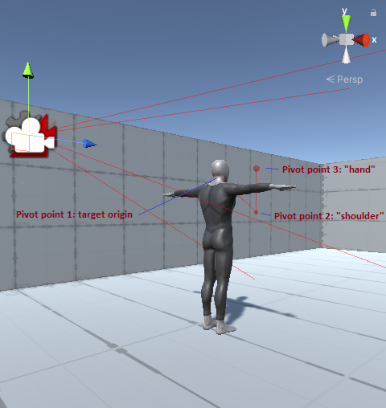

# 3rd Person Follow

This Virtual Camera __Body__ algorithm is intended for use to implement a 3rd-person or 1st person camera.  The algorithm places the camera on a mini-rig with 3 pivot points:

Pivot point 1 is the _origin_, which is the Follow target's position.  When the target rotates horizontally, the rig rotates with it around this point.

Pivot point 2 is the _shoulder_, and by default is offset to one side of Pivot Point 1, to create an over-the-shoulder follow position.  To make a 1st-person camera, set this offset to 0, or to whatever will give an appropriate 1st-person effect given your Follow target's position.  Vertical rotations of the Follow target are transferred here, so the rig rotates horizontally about the origin, and vertically about the shoulder.

Pivot point 3 is the _hand_.  This is by default offset from the shoulder, so that vertical rotations will keep the character nicely positioned on the screen.  For 1st-person cameras, this can be set to 0.

Finally, the camera is positioned behind the hand, at a specifiable distance from it.  The camera's rotation will always be parallel to the Follow target's rotation, but positioned behind the hand.

The camera's position and rotation are controlled by moving and rotating the Follow target, not by independent camera controls.

The 3rd-person Follow module has a built-in collision resolution system, so that if the target moves close to an obstacle, the camera position will be adjusted so that it will never be inside an obstacle.

## Properties:

| **Property:** || **Function:** |
|:---|:---|:---|
| __Damping__ || How responsively the camera tracks the target.  Each axis (camera-local) can have its own setting.  Value is the approximate time it takes the camera to catch up to the target's new position.  Smaller values give a more rigid effect, larger values give a squishier one |
| __Shoulder Offset__ || Position of the shoulder pivot relative to the Follow target origin.  This offset is in target-local space. |
| __Vertical Arm Length__ || Vertical offset of the hand in relation to the shoulder.  Arm length will affect the follow target's screen position when the camera rotates vertically.  |
| __Camera Side__ || Specifies which shoulder (left, right, or in-between) the camera is on.   |
| __Camera Distance__ || How far behind the hand the camera will be placed.   |
| __Camera Collision Filter__ || Camera will avoid obstacles on these layers.  |
| __Ignore Tag__ || Obstacles with this tag will be ignored.  It is a good idea to set this field to the target's tag. |
| __Camera Radius__ || Specifies how close the camera can get to obstacles.  |

